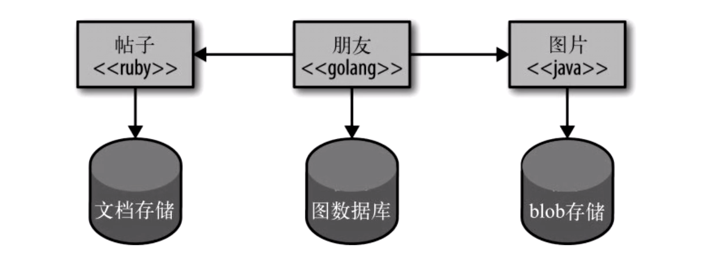

# 微服务的优点
## 1. 技术异构性
一个大型互联网公司可能部署了上千个服务，这些服务可能使用了不同的编程语言开发。
与此同时，除了不同语言的需求之外，还有不同的业务需求可能也需要进行服务拆分；比如对于社交网络而言，图数据库能更好的处理用户之间的交互操作，但对于用户发布的帖子，文档数据库可能是个更好的选择。

## 2. 弹性
如果系统中的一个组件不可用了，但没有导致级联故障，那么系统的其他部分还可以正常运行。
在单机系统中，如果一个服务不可用，会导致所有功能不可用。但对于微服务而言，合理的拆分和弹性处理，能很好的处理服务不可用和功能降级问题。

## 3. 扩展
单机系统只能作为一个整体进行扩展。即使系统中只有一小部分存在性能问题，也需要对整个服务进行扩展。如果使用较小的多个服务，则可以只对需要扩展的服务进行扩展。

## 4. 简化部署
在有几百万行代码单机系统中，即使只修改一行代码，也需要重新部署整个程序才能发布变更。这种不舒服昂视影响很大、风险很高。于是在实际操作中，部署频率就会尽量降低，这。这意味着两次部署之间我们修改了更多的代码，这时出错的可能性就更高了。
在微服务中，各个服务独立部署，如果出现问题也只会影响一个服务。同时也可以做到更快的迭代需求

## 5. 与组织结构相匹配
微服务架构可以很好的将架构与组织结构相匹配，避免出现过大的代码库，也能把不同的业务分给不同的团队，从而获得理想的团队大小及生产力。

## 6. 可组合性
易于重用已有的功能

## 7. 对可替代性的优化
可以轻易的重写服务，或者删除不再使用的服务。

### 参考资料
《微服务设计》作者：Sam Newman