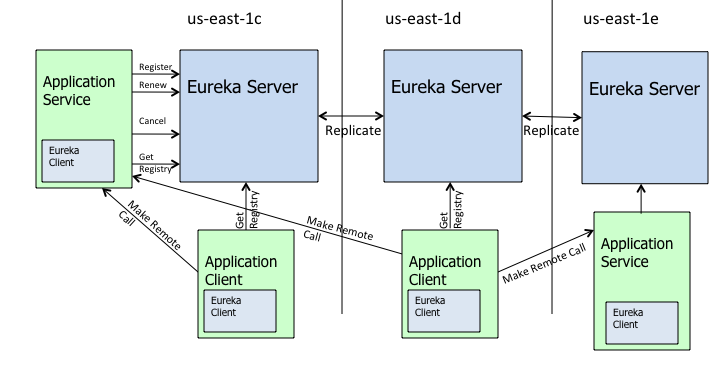

# Eureka 解析
## Eureka 如何工作

服务启动后向Eureka注册，Eureka Server会将注册信息向其他Eureka Server进行同步，但该服务消费者要调用服务提供者，则向服务注册中心获取服务提供者的地址，然后会将服务者地址缓存在本地，下次调用时，直接从缓存中取出完成一次调用。

当服务注册中心Eureka Server检测到服务提供者因为宕机、网络原因不可用时，则在服务注册中心将服务置为down状态，并把当前服务提供者状态向订阅者发布，订阅过的服务消费者更新本地缓存。

服务提供者在启动后，周期性（默认30秒）向Eureka Server发送心跳，以证明当前服务是可用状态。Eureka Server在一定的时间（默认90秒）未收到客户端的心跳，则认为服务宕机，注销该实例。

## 自我保护机制
在默认配置中，Eureka Server在默认90秒没有得到客户端的心跳，则注销该实例，但是往往因为微服务进程调用，网络通信往往会面临着各种问题，比如微服务状态正常，但是因为网络区分故障时，Eureka Server注销服务实例则会让大部分微服务不可用，这很危险，因为服务明明没问题。
	
为了解决这个问题，Eureka 有自我保护机制，通过Eureka Server配置参数可启动保护机制。参数：eureka.server.enable-self-preservation = false
	
**Eureka 协议要求客户端在永久离开时执行显式取消注册操作。**
	
Eureka Server 在运行期间会去统计心跳失败比例在 15 分钟之内是否低于 85%，如果低于 85%，Eureka Server 会将这些实例保护起来，让这些实例不会过期，但是在保护期内如果服务刚好这个服务提供者非正常下线了，此时服务消费者就会拿到一个无效的服务实例，此时会调用失败，对于这个问题需要服务消费者端要有一些容错机制，如重试，断路器等。

总结一下会出现以下几种情况： 
1. Eureka不再从注册列表中移除因为长时间没收到心跳而应该过期的服务 
2. Eureka仍然能够接受新服务的注册和查询请求，但是不会被同步到其它节点上(即保证当前节点依然可用) 
3. 当网络稳定时，当前实例新的注册信息会被同步到其它节点中

## Eureka 相比 Zookeeper 的优势在哪？
著名的CAP理论指出，一个分布式系统不可能同时满足C(一致性)、A(可用性)和P(分区容错性)。由于分区容错性在是分布式系统中必须要保证的，因此我们只能在A和C之间进行权衡。**在此Zookeeper保证的是CP, 而Eureka则是AP。**

### Zookeeper
当向注册中心查询服务列表时，我们可以容忍注册中心返回的是几分钟以前的注册信息，但不能接受服务直接down掉不可用。也就是说，服务注册功能对可用性的要求要高于一致性。

但是zk会出现这样一种情况，当master节点因为网络故障与其他节点失去联系时，剩余节点会重新进行leader选举。问题在于，选举leader的时间太长，30 ~ 120s, 且选举期间整个zk集群都是不可用的，这就导致在选举期间注册服务瘫痪。在云部署的环境下，因网络问题使得zk集群失去master节点是较大概率会发生的事，虽然服务能够最终恢复，但是漫长的选举时间导致的注册长期不可用是不能容忍的。

### Eureka
Eureka看明白了这一点，因此在设计时就优先保证可用性。Eureka各个节点都是平等的，几个节点挂掉不会影响正常节点的工作，剩余的节点依然可以提供注册和查询服务。而Eureka的客户端在向某个Eureka注册或时如果发现连接失败，则会自动切换至其它节点，只要有一台Eureka还在，就能保证注册服务可用(保证可用性)，只不过查到的信息可能不是最新的(不保证强一致性)。

因此， Eureka可以很好的应对因网络故障导致部分节点失去联系的情况，而不会像zookeeper那样使整个注册服务瘫痪。