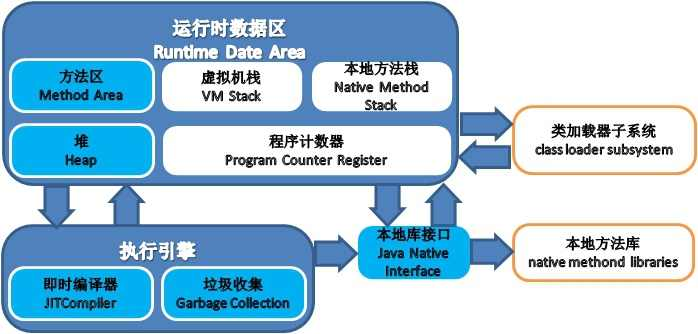

# JVM 运行时数据区域

*蓝色代表线程共享区域*

*白色代表线程隔离区域*

## 程序计数器

它可以看做是当前线程锁执行的字节码的行号指示器。 **字节码解释器工作时就是通过修改这个计数器的值，来选取下一条需要执行的字节码指令，分支、循环、跳转、异常处理、线程恢复等基础功能。**

在 Java 虚拟机中的多线程是通过线程轮流切换并分配处理器执行时间的方式来实现的，在任何一个时刻，一个处理器都只会执行一条线程中的指令。因此为了线程切换后能恢复到正确的执行位置，每条线程都需要一个独立的程序计数器，各线程的计数器互不影响。

## Java 虚拟机栈
Java 虚拟机栈的生命周期与线程相同。 **虚拟机栈描述的是 Java 方法执行的内存模型：每个方法在执行的同事都会创建一个栈帧（Stack Frame）用于存储局部变量表、操作数栈、动态链接、方法出口等信息。** 每一个方法从调用到执行完毕，对应着一个栈帧在 Java 虚拟机栈中入栈到出栈的过程。

**在编译Java程序源码的时候，栈帧中需要多大的局部变量表，需要多深的操作数栈就已经被分析计算出来。** 换言之，一个栈帧需要分配多少内存，并不会受到程序运行期变量数据的影响，而仅仅取决于程序源码和具体的虚拟机实现的栈内存布局形式。

### 局部变量表
局部变量表保存了这些信息：
- 编译期可知的各种基本数据类型（boolean byte char short int float long double）
- 对象引用（reference 类型，它不等同于对象本身，可能是一个指向对象起始地址的引用指针，也可能是指向一个代表对象的句柄或其他与此对象相关的位置）
- returnAddress 类型（指向了一条字节码指令）

局部变量表所需的内存空间在编译期间完成分配，当进入一个方法时，这个方法需要在帧中分配多大的局部变量空间是完全确定的，在方法运行期间不会改变局部变量表的大小。

## 本地方法栈

本地方法栈与虚拟机栈发挥的作用相似，它们之间的区别不过是虚拟机栈为虚拟机执行 Java 方法服务，而本地方法栈则为虚拟机使用到的 native 方法服务。

## Java 堆

**此内存区域的唯一目的就是存放对象实例，几乎所有的对象实例都在这里分配内存。** Java 堆是垃圾收集器管理的主要区域（注意，不是唯一区域）。从分代收集的算法来看，通常 Java 堆会被划分为年轻代和老年代，年轻代又可以被划分为 eden 区和两个 survivor 区。

根据 Java 虚拟机规范的规定，Java 堆可以处于物理上不连续的内存空间，只要逻辑上是连续的即可。

## 方法区

**方法区用于存储已被虚拟机加载的类信息、常量、静态变量、即时编译器编译后的代码等数据。** HotSpot 虚拟机的设计是垃圾收集器同样可以作用于方法区，这个区域的内存回收目标主要有两个，一是常量池的回收，二是类型卸载。

### 运行时常量池
运行时常量池是方法区的一部分。Class 文件中有一项信息是常量池，用于存放编译期生成的各种字面量和符号引用，这部分内容将在类加载后进入方法区的运行时常量池。除此以外，还会把根据符号引用翻译出来的直接引用也存入运行时常量池。