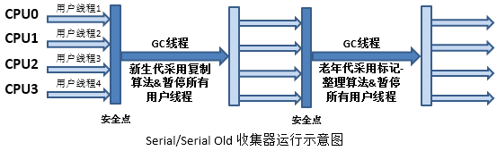
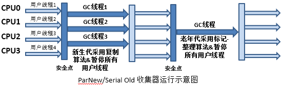
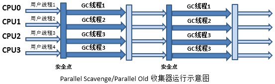

# JVM 垃圾回收

## 垃圾回收算法
1. 标记-清除
2. 标记-整理
3. 复制算法

### 标记-清除
该算法分为“标记”和“清除”两个阶段，首先标记出所有需要回收的对象，在标记完成后统一回收所有被标记的对象。
	
该算法有两大不足：
1. 效率低
2. 标记清除后会产生大量不连续的内存碎片

### 标记-整理
该算法标记过程与“标记-清除算法”一致，但后续步骤是让所有存活的对象都向一端移动，然后直接清理掉端边界意外的内存。

### 复制算法
该算法将可用内存按容量划分为大小相等的两块，每次只是用一块内存。当这一块内存用完了，就将还存活着的对象复制到另外一块上面，然后再把已使用过的内存一次性清理掉。

## 垃圾回收器
HotSpot 中采用分代处理的方式进行垃圾回收，分为年轻代和老年代。共有7种不同的垃圾回收器，连线说明它们可以搭配使用

### Serial（串行GC-复制法）
单线程收集器，在它进行垃圾收集时，必须暂停其他所有工作的线程。

### ParNew（并行GC-复制法）
该收集器其实是Serial的多线程版本，除了使用多条线程进行垃圾收集，其余规则、策略均与Serial完全一样。

### Parallel Scavenge（并行GC-复制法）
前面介绍的收集器重点关注的是尽可能的缩短垃圾收集时用户线程的停顿时间，而该收集器重点关注的是吞吐量，即吞吐量=运行用户代码时间/(运行用户代码时间+垃圾收集时间)。

停顿时间越短越适合需要与用户交互的程序，而高吞吐量则可以高效率的利用CPU时间，尽快完成程序的运算任务，主要适合在后台运算而不需要太多交互任务

### Serial Old（串行GC-标记整理法）
这个收集器的主要意义也是在于给client模式下的虚拟机使用。如果是server模式下，那么它主要还有两大用途：一是在JDK1.5以及之前与Parallel Scavenge配合，二是作为CMS的后备预案

### Parallel Old（并行GC-标记整理法）
Parallel Scavenge的老生代版本，采用Mark-Compact算法和多线程。

### CMS & G1
CMS 和 G1 的可以说是一个重量级的存在，在面试中也是高频问题，将单独用一篇文章来讲解。

[CMS & G1](./03-CMS-G1.md)