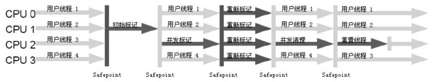

# CMS & G1
## CMS 
CMS收集器基于“标记-清除”算法实现，整个过程分为4个步骤：
1. 初始标记，仅仅只是标记一下GC Roots能直接关联到的对象，速度非常快。
2. 并发标记，进行GR Roots Tracing的过程
3. 重新标记，为了修正并发标记期间因用户程序继续运作而导致标记产生变动的一部分，这个阶段的停顿时间会比初始标记稍长一些，但远比并发标记时间短。
4. 并发清除

其中**初始标记**和**重新标记**仍然需要“Stop the World”。

### :exclamation: 缺点
- 对CPU资源非常敏感。在并发阶段，它虽然不会导致用户线程停顿，但会因为占用了一部分线程而导致应用程序变慢，总吞吐量会降低。
- 无法处理浮动垃圾，可能出现 "Concurrent Mode Failure" 失败而导致另一次Full GC产生。由于并发清除时用户线程还在运行，伴随程序运行自然还有新的垃圾不断产生，这一部分垃圾出现在标记之后，CMS无法在当次收集中处理它们，只好留待下一次GC清理。	
- “标记-清除”可能带来提前 Full GC 。 因为该算法会产生内存空间碎片，当空间碎片过多时，就会出现老年代还有很大的空间剩余，但无法找到足够大的连续控件来分配当前对象，不得不提前 Full GC 。（为了解决这个问题，CMS提供了一个开关参数，默认开启，用于在CMS顶不住要进行 Full GC 时开启内存碎片合并整理，这个动作是无法并发的，所以如果触发这个过程也会增长停顿时间）
- 同样也是由于在垃圾收集阶段用户线程还需要持续运行，那就还需要预留足够内存空间提供给用户线程使用，因此CMS收集器不能像其他收集器那样等待到老年代几乎完全被填满了再进行收集，必须预留一部分空间供并发收集时的程序运作使用。在JDK 6的默认设置下，老年代使用92%的空间就会触发CMS。

## G1 (Garbage First)
为解决CMS算法产生空间碎片和其它一系列的问题缺陷，HotSpot提供了另外一种垃圾回收策略，G1（Garbage First）算法，通过参数-XX:+UseG1GC来启用，该算法在JDK 7u4版本被正式推出。在JDK 9中CMS收集器已经被标记为过时，更推荐使用G1。

在G1算法中，采用了另外一种完全不同的方式组织堆内存，堆内存被划分为多个大小相等的内存块（Region），每个Region是逻辑连续的一段内存，结构如下：

*其中H是以往算法中没有的，它代表Humongous，这表示这些Region存储的是巨型对象（humongous object，H-obj），当新建对象大小超过Region大小一半时，直接在新的一个或多个连续Region中分配，并标记为H。*

### G1 如何执行 GC
G1中提供了三种模式垃圾回收模式，young gc、mixed gc 和 full gc，在不同的条件下被触发。

#### Young GC
发生在年轻代的GC算法，一般对象（除了巨型对象）都是在eden region中分配内存，当所有eden region被耗尽无法申请内存时，就会触发一次young gc，这种触发机制和之前的young gc差不多，执行完一次young gc，活跃对象会被拷贝到survivor region或者晋升到old region中，空闲的region会被放入空闲列表中，等待下次被使用。

#### Mixed GC
当越来越多的对象晋升到老年代old region时，**为了避免堆内存被耗尽，虚拟机会触发一个混合的垃圾收集器，即mixed gc，该算法并不是一个old gc**，除了回收整个young region，还会回收一部分的old region，这里需要注意：是一部分老年代，而不是全部老年代，可以选择哪些old region进行收集，从而可以对垃圾回收的耗时时间进行控制。

mixed gc的执行过程有点类似cms，主要分为以下几个步骤：

1. initial mark: 初始标记过程，整个过程STW，标记了从GC Root可达的对象
2. concurrent marking: 并发标记过程，整个过程gc collector线程与应用线程可以并行执行，标记出GC Root可达对象衍生出去的存活对象，并收集各个Region的存活对象信息
3. remark: 最终标记过程，整个过程STW，标记出那些在并发标记过程中遗漏的，或者内部引用发生变化的对象
4. clean up: 垃圾清除过程，如果发现一个Region中没有存活对象，则把该Region加入到空闲列表中

#### Full GC
如果对象内存分配速度过快，mixed gc来不及回收，导致老年代被填满，就会触发一次full gc，G1的full gc算法就是单线程执行的serial old gc，会导致异常长时间的暂停时间，需要进行不断的调优，尽可能的避免full gc