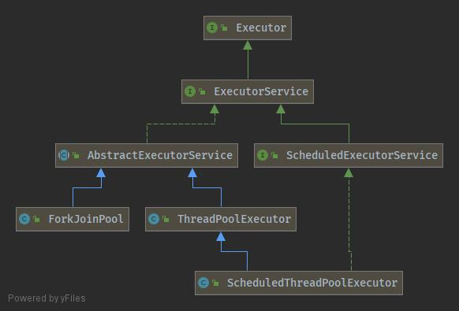
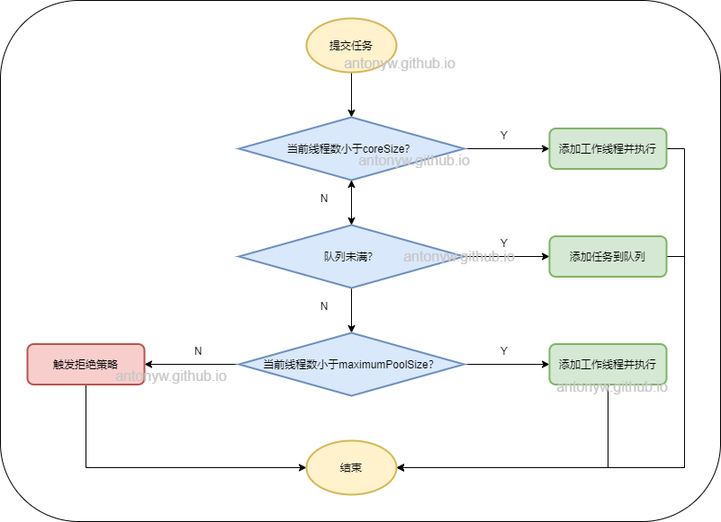
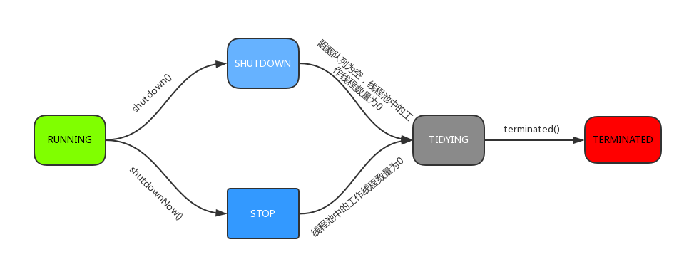

# ThreadPool 参数详解
先看一下ThreadPoolExecutor的类图，本文说到的ThreadPoolExecutor继承自AbstractExecutorService，并实现了ExecutorService接口。



下面展示一个线程池，它的核心线程数为4，最大线程数为20，线程允许最大空闲时间为3秒，并且持有一个长度为100的有界队列。
```java
   ThreadPoolExecutor executor = new ThreadPoolExecutor(4, 20, 
            3, TimeUnit.SECONDS,
            new ArrayBlockingQueue<Runnable>(100));
```

在ThreadPoolExecutor中有4个构造方法，上述代码使用了其中一个。
```java
    // 其它的构造方法，可以自定义选择 ThreadFactory 和 RejectedExecutionHandler
    public ThreadPoolExecutor(int corePoolSize,
                              int maximumPoolSize,
                              long keepAliveTime,
                              TimeUnit unit,
                              BlockingQueue<Runnable> workQueue) {
        this(corePoolSize, maximumPoolSize, keepAliveTime, unit, workQueue,
             Executors.defaultThreadFactory(), defaultHandler);
    }
````
## 线程池参数详解
### coreSize / maximumPoolSize
核心线程数量，当有新任务在execute()方法提交时，会执行以下判断：
1. 如果运行的线程少于 corePoolSize，则创建新线程来处理任务，即使线程池中的其他线程是空闲的；
2. 如果线程池中的线程数量大于等于 corePoolSize 且小于 maximumPoolSize，则只有当workQueue满时才创建新的线程去处理任务；
3. 如果设置的corePoolSize 和 maximumPoolSize相同，则创建的线程池的大小是固定的，这时如果有新任务提交，若workQueue未满，则将请求放入workQueue中，等待有空闲的线去从workQueue中取任务并处理；
4. 如果运行的线程数量大于等于maximumPoolSize，这时如果workQueue已经满了，则通过handler所指定的策略来处理任务；

### workQueue
等待队列，当任务提交时，如果线程池中的线程数量大于等于corePoolSize的时候，把该任务封装成一个Worker对象放入等待队列。
保存等待执行的任务的阻塞队列，当提交一个新的任务到线程池以后, 线程池会根据当前线程池中正在运行着的线程的数量来决定对该任务的处理方式，主要有以下几种处理方式：
- SynchronousQueue
- LinkedBlockingQueue（无界队列）如果使用这种方式，那么线程池中能够创建的最大线程数就是corePoolSize，而maximumPoolSize就不会起作用了（后面也会说到）。当线程池中所有的核心线程都是RUNNING状态时，这时一个新的任务提交就会放入等待队列中。
- ArrayBlockingQueue（有界队列）使用该方式可以将线程池的最大线程数量限制为maximumPoolSize，这样能够降低资源的消耗，但同时这种方式也使得线程池对线程的调度变得更困难，因为线程池和队列的容量都是有限的值，所以要想使线程池处理任务的吞吐率达到一个相对合理的范围，又想使线程调度相对简单，并且还要尽可能的降低线程池对资源的消耗，就需要合理的设置这两个数量。
#### 注意
-  如果要想降低系统资源的消耗（包括CPU的使用率，操作系统资源的消耗，上下文环境切换的开销等）, 可以设置较大的队列容量和较小的线程池容量, 但这样也会降低线程处理任务的吞吐量。
- 如果提交的任务经常发生阻塞，那么可以考虑通过调用 setMaximumPoolSize() 方法来重新设定线程池的容量。
- 如果队列的容量设置的较小，通常需要将线程池的容量设置大一点，这样CPU的使用率会相对的高一些。但如果线程池的容量设置的过大，则在提交的任务数量太多的情况下，并发量会增加，那么线程之间的调度就是一个要考虑的问题，因为这样反而有可能降低处理任务的吞吐量。

### keepAliveTime
线程池维护线程所允许的空闲时间。当线程池中的线程数量大于corePoolSize的时候，如果这时没有新的任务提交，核心线程外的线程不会立即销毁，而是会等待，直到等待的时间超过了keepAliveTime

### threadFactory
它是ThreadFactory类型的变量，用来创建新线程。默认使用Executors.defaultThreadFactory() 来创建线程。使用默认的ThreadFactory来创建线程时，会使新创建的线程具有相同的NORM_PRIORITY优先级并且是非守护线程，同时也设置了线程的名称

### handler
它是RejectedExecutionHandler类型的变量，表示线程池的饱和策略。如果阻塞队列满了并且没有空闲的线程，这时如果继续提交任务，就需要采取一种策略处理该任务。线程池提供了4种策略：
- AbortPolicy：直接抛出异常，这是默认策略；
- CallerRunsPolicy：用调用者所在的线程来执行任务；
- DiscardOldestPolicy：丢弃阻塞队列中靠最前的任务，并执行当前任务；
- DiscardPolicy：直接丢弃任务；

## 线程池的运行逻辑
线程池有两种使用方式，有返回值的submit方法和无返回值的execute方法。
```java
        // 有返回值
        Future<Boolean> future = executor.submit(() -> productService.add(new Product()));
        // 无返回值
	executor.execute(() -> productService.add(new Product()));
```
我们继续追踪代码会发现，其实submit方法中还是调用了execute方法，所以我们先看execute方法中的逻辑，其中任务提交到线程池中的流程如下图所示。



对应这一段代码
```java
	int c = ctl.get();
        if (workerCountOf(c) < corePoolSize) {
            if (addWorker(command, true))
                return;
            c = ctl.get();
        }
        if (isRunning(c) && workQueue.offer(command)) {
            int recheck = ctl.get();
            if (! isRunning(recheck) && remove(command))
                reject(command);
            else if (workerCountOf(recheck) == 0)
                addWorker(null, false);
        }
        else if (!addWorker(command, false))
            reject(command);
```

## 线程的五种状态
1. **RUNNING：** 能接受新提交的任务，并且也能处理阻塞队列中的任务；
2. **SHUDOWN：** 关闭状态，不再接受新提交的任务，但却可以继续处理阻塞队列中已保存的任务。在线程池处于 RUNNING 状态时，调用 shutdown()方法会使线程池进入到该状态。（finalize() 方法在执行过程中也会调用shutdown()方法进入该状态）；
3. **STOP：** 不能接受新任务，也不处理队列中的任务，会中断正在处理任务的线程。在线程池处于 RUNNING 或 SHUTDOWN 状态时，调用 shutdownNow() 方法会使线程池进入到该状态；
4. **TYDYING：** 如果所有的任务都已终止了，workerCount (有效线程数) 为0，线程池进入该状态后会调用terminated() 方法进入TERMINATED 状态；
5. **TERMINATED：** 在terminated() 方法执行完后进入该状态，默认terminated()方法中什么也没有做。 进入TERMINATED的条件如下：
- 线程池不是RUNNING状态；
- 线程池状态不是TIDYING状态或TERMINATED状态；
- 如果线程池状态是SHUTDOWN并且workerQueue为空；
- workerCount为0；
- 设置TIDYING状态成功。


## 何时使用线程池？
- 单个任务处理时间比较短
- 需要处理的任务数量很大

## 线程池有哪些优势？
- 降低资源消耗。通过重复利用已创建的线程降低线程创建和销毁造成的消耗。
- 提高响应速度。当任务到达时，任务可以不需要的等到线程创建就能立即执行。
- 提高线程的可管理性。线程是稀缺资源，如果无限制的创建，不仅会消耗系统资源，还会降低系统的稳定性，使用线程池可以进行统一的分配，调优和监控。
		
## 合理预估线程池参数

最佳线程数目 = （线程等待时间 / 线程CPU时间 +1）* CPU数目

线程等待时间所占比例越高，说明需要越多线程。

线程CPU时间所占比例越高，则线程越少。
