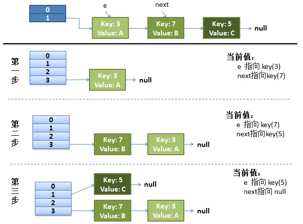
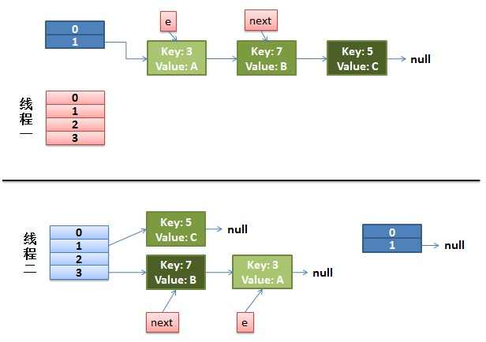
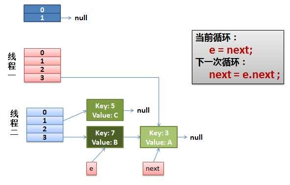
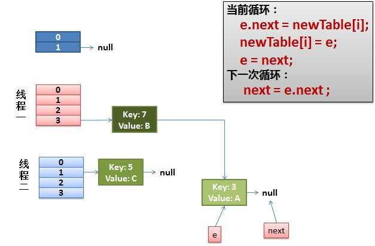
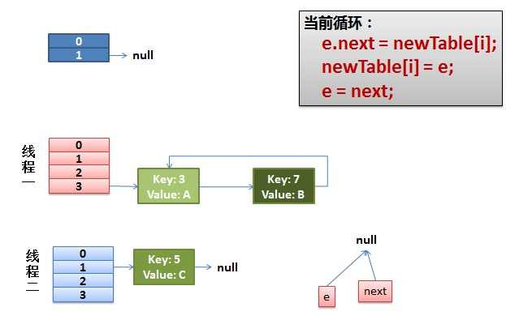

# JDK 1.7 中hashmap扩容为何出现死循环
## Put一个Key,Value对到Hash表中的过程
```java
public V put(K key, V value)
{
    ......
    //算Hash值
    int hash = hash(key.hashCode());
    int i = indexFor(hash, table.length);
    //如果该key已被插入，则替换掉旧的value （链接操作）
    for (Entry<K,V> e = table[i]; e != null; e = e.next) {
        Object k;
        if (e.hash == hash && ((k = e.key) == key || key.equals(k))) {
            V oldValue = e.value;
            e.value = value;
            e.recordAccess(this);
            return oldValue;
        }
    }
    modCount++;
    //该key不存在，需要增加一个结点
    addEntry(hash, key, value, i);
    return null;
}

void addEntry(int hash, K key, V value, int bucketIndex)
{
    Entry<K,V> e = table[bucketIndex];
    table[bucketIndex] = new Entry<K,V>(hash, key, value, e);
    //查看当前的size是否超过了我们设定的阈值threshold，如果超过，需要resize
    if (size++ >= threshold)
        resize(2 * table.length);
}

void resize(int newCapacity)
{
    Entry[] oldTable = table;
    int oldCapacity = oldTable.length;
    ......
    //创建一个新的Hash Table
    Entry[] newTable = new Entry[newCapacity];
    //将Old Hash Table上的数据迁移到New Hash Table上
    transfer(newTable);
    table = newTable;
    threshold = (int)(newCapacity * loadFactor);
}

//注意Entry迁移逻辑：
void transfer(Entry[] newTable)
{
    Entry[] src = table;
    int newCapacity = newTable.length;
    //下面这段代码的意思是：
    //  从OldTable里摘一个元素出来，然后放到NewTable中
    for (int j = 0; j < src.length; j++) {
        Entry<K,V> e = src[j];
        if (e != null) {
            src[j] = null;
            do {
                Entry<K,V> next = e.next;
                int i = indexFor(e.hash, newCapacity);
                e.next = newTable[i];
                newTable[i] = e;
                e = next;
            } while (e != null);
        }
    }
}

```
## 先看一个正常的 rehash 过程


## 可能出问题的 rehash 过程
假设我们有两个线程，线程1和线程2用红色和蓝色分别标注。
### 1. 当代码执行到这里，线程1被调度挂起
```java
	do {
	    Entry<K,V> next = e.next; // <--假设线程一执行到这里就被调度挂起了
	    int i = indexFor(e.hash, newCapacity);
	    e.next = newTable[i];
	    newTable[i] = e;
	    e = next;
} while (e != null);
```
**而我们的线程二执行完成了。**
**于是我们有下面的这个样子**。

因为Thread1的 e 指向了key(3)，而next指向了key(7)，其在线程二rehash后，指向了线程二重组后的链表。

### 2.线程2被调度回来
先是执行 newTalbe[i] = e;
然后是e = next，导致了e指向了key(7)，
而下一次循环的next = e.next导致了next指向了key(3)


### 3.然后
把key(7)摘下来，放到newTable[i]的第一个，然后把e和next往下移。


### 4.环形链接出现
e.next = newTable[i] 导致  key(3).next 指向了 key(7)
注意：此时的key(7).next 已经指向了key(3)， 环形链表就这样出现了。
