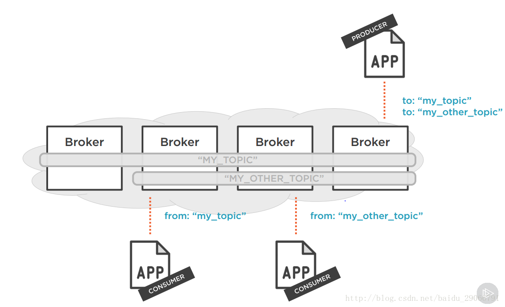
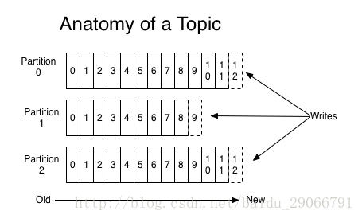

# Kafka 架构设计
### Broker
Kafka集群包含一个或多个服务器，这种服务器被称为broker。
### Topic
每条发布到Kafka集群的消息都有一个类别，这个类别被称为Topic（物理上不同Topic的消息分开存储，逻辑上一个Topic的消息虽然保存于一个或多个broker上但用户只需指定消息的Topic即可生产或消费数据而不必关心数据存于何处）。
### Partition
Parition是物理上的概念，每个Topic包含一个或多个Partition。
### Producer
负责发布消息到Kafka broker。
### Concumer
消息消费者，向Kafka broker读取消息的客户端。
### Concumer Group
每个Consumer属于一个特定的Consumer Group（可为每个Consumer指定group name，若不指定group name则属于默认的group）。

一个典型的Kafka集群中包含若干Producer（可以是web前端产生的Page View，或者是服务器日志，系统CPU、Memory等），若干broker（Kafka支持水平扩展，一般broker数量越多，集群吞吐率越高），若干Consumer Group，以及一个Zookeeper集群。Kafka通过Zookeeper管理集群配置，选举leader，以及在Consumer Group发生变化时进行rebalance。Producer使用push模式将消息发布到broker，Consumer使用pull模式从broker订阅并消费消息。

## Topic & Partition
Topic在逻辑上可以被认为是一个queue，每条消费都必须指定它的Topic，可以简单理解为必须指明把这条消息放进哪个queue里。为了使得Kafka的吞吐率可以线性提高，物理上把Topic分成一个或多个Partition，每个Partition在物理上对应一个文件夹，该文件夹下存储这个Partition的所有消息和索引文件。

Kafka将新消息追加到Partition中，属于顺序写磁盘，因此效率非常高，这也就是为什么Kafka的吞吐量如此之高的原因之一。

传统的消息队列通常会删除已被消费的消息，而Kafka并不会这么做，无论是否被消费该消息都会保存。Kafka通过offset这个偏移量来指示这个queue中的消息消费到了何处。

因为磁盘限制，不可能永远保存消息，Kafka提供了两种策略删除旧数据。一是基于时间，二是基于Partition文件大小。

上面说到Kafka通过偏移量来指示queue中的消息消费到了何处，因此Kafka读取特定消息的时间复杂度为O(1)，与文本大小无关，所以这里删除过期文件与提高Kafka性能无关，同样选择上述的何种删除策略只与具体业务需求和磁盘属性相关。

这个offset由Consumer控制，正常情况下Consumer在消费一条消息后递增该offset，但Consumer也可以干预offset的设置，这样便可以消费历史消息。不难发现，这么操作的好处是对于broker来说，消息是无状态的，它不需要标记哪些消息被消费过，无状态也就无需加锁。这便是Kafka高吞吐量原因之二。

### Producer 消息路由
Producer发送消息到broker时，会根据Paritition机制选择将其存储到哪一个Partition。如果Partition机制设置合理，所有消息可以均匀分布到不同的Partition里，这样就实现了负载均衡。如果一个Topic对应一个文件，那这个文件所在的机器I/O将会成为这个Topic的性能瓶颈，而有了Partition后，不同的消息可以并行写入不同broker的不同Partition里，极大的提高了吞吐率。

### Consumer Group
同一Topic的一条消息只能被同一个Consumer Group内的一个Consumer消费，但多个Consumer Group可同时消费这一消息。这是Kafka实现一个Topic消息的广播和单播的手段。

## 送达保证
有这么几种可能的delivery guarantee：
- At most once 消息可能会丢，但绝不会重复传输
- At least once 消息绝不会丢，但可能会重复传输
- Exactly once 每条消息肯定会被传输一次且仅传输一次，很多时候这是用户所想要的。

### Producer to Broker
因为replication的存在，当Producer向broker发送消息时，一旦消息被commit，它就不会丢失。但是如果Producer发送数据给Broker后，遇到网络问题而造成通信终端，那Producer该如何判断该条消息是否已经commit。

在0.11.0.0之前，如果生产者未能收到指示消息已提交的响应，则除了重新发送消息之外别无选择。

从0.11.0.0开始，Kafka生成器还支持幂等传递选项，该选项保证重新发送不会在日志中导致重复条目。为实现此目的，代理为每个Producer分配一个ID，并使用Producer发送的序列号和每条消息对消息进行重复数据删除。

因此Producer 到 Broker 的过程，Kafka 保证了At least once语义。

### Broker to Consumer
上面我们了解到，offset是由Consumer控制的，所以如果消费者失败并且我们希望该topic partition 被另一个进程接管，则新进程将需要选择适当的位置以开始处理。在此情况下，我们看一下Consumer该如何读新消息：
1. 读取消息 - 保存position - 处理消息：**如果Consumer在保存position后处理消息之前宕机**，那么新的进程接管之后，将从该position开始处理，尽管它之前的一些消息尚未处理，这对应于 At most once 语义，因为消息可能会丢失。
2. 读取消息 - 处理消息 - 保存position：**如果Consumer在处理消息后保存position之前宕机**，那么新的进程接管之后，将重复处理之前的消息（由于唯一ID的存在，所以可以正常的做幂等处理），这对应于 At least once 语义。

### 参考资料
http://kafka.apache.org/20/documentation.html#design

http://www.jasongj.com/2015/03/10/KafkaColumn1/
