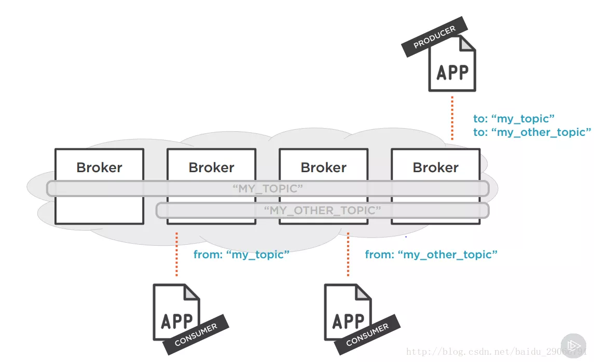

# Kafka 架构
### Broker
Kafka集群包含一个或多个服务器，这种服务器被称为broker。
### Topic
每条发布到Kafka集群的消息都有一个类别，这个类别被称为Topic（物理上不同Topic的消息分开存储，逻辑上一个Topic的消息虽然保存于一个或多个broker上但用户只需指定消息的Topic即可生产或消费数据而不必关心数据存于何处）。
### Partition
Parition是物理上的概念，每个Topic包含一个或多个Partition。
### Producer
负责发布消息到Kafka broker。
### Concumer
消息消费者，向Kafka broker读取消息的客户端。
### Concumer Group
每个Consumer属于一个特定的Consumer Group（可为每个Consumer指定group name，若不指定group name则属于默认的group）。

---

若干Producer（可以是web前端产生的Page View，或者是服务器日志，系统CPU、Memory等）。

若干Broker（Kafka支持水平扩展，一般Broker数量越多，集群吞吐率越高）。

若干Consumer Group。

一个Zookeeper集群。Kafka通过Zookeeper管理集群配置，选举leader，以及在Consumer Group发生变化时进行rebalance。

Producer使用push模式将消息发布到broker，Consumer使用pull模式从broker订阅并消费消息。