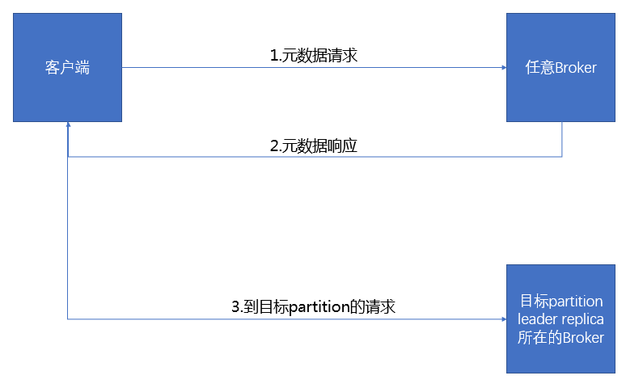
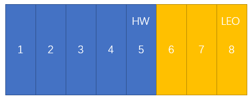

# Kafka Replication
在 Kafka 官方文档里把自己描述为“一个分布式的流处理平台”，既然是分布式系统就离不开一个老生常谈的话题——高可用（High Availability）。

在0.8版本之前的 Kafka 是没有实现 HA 机制的，一旦 broker 宕机，则宕机期间该 broker 上的所有 partition 均无法再提供服务。如果这个机器永久性损坏，则这部分数据将永久丢失。这与 Kafka 的设计初衷相差甚远，所以在0.8版本之后的 Kafka 引入了复制功能提供 HA 机制。

## 复制功能如何实现 HA 
Kafka 的复制功能最小单元是分区（partition），一个 partition 可以拥有多个副本（replica），副本分为两种，一是首领副本（leader replica），二是跟随者副本（follower replica）。

- **leader replica**：每个 partition 都有一个 leader replica。为了保证一致性，所有生产者和消费者的请求都会经过这个副本。

- **follower replica**：除 leader replica 之外的副本都是 follower replica。follower replica 不处理来自客户端的请求，它们唯一的人物就是从 leader 那里复制消息，保持与 leader 一致的状态。如果 leader 发生崩溃，其中一个 follower 会被提升为新 Leader。

## 不难看出 Kafka 要解决这么几个关键问题
1. 只有 leader replica 才能执行读写请求，那么 producer 或 consumer 如何找到 leader replica 存在于哪个 broker ？
2. follower 和 leader 不在一台机器上，就一定会出现延时问题，Kafka 如何解决消息不一致问题？
3. leader 宕机后什么样的 follower 才有资格被选为新 leader？
4. 谁来做选举动作？
5. 选举的算法？
6. partition 的所有 replica 全部宕机怎么办？

## 请求如何发送到 leader replica
当针对某个 partition 的消息发送到了不含有该 partition leader replica 的 broker 上，客户端会受到一个“非分区首领”的错误响应。Kafka 的解决方案是客户端要自己负责把请求发送到正确的 broker 上。

客户端使用了另一种请求类型，也就是**元数据请求**。这种请求包含了客户端感兴趣的 topic 列表。服务端响应消息里指明了这些 topic 所包含的 partition、每个 partition 都有哪些副本，以及哪些副本是 leader。

元数据请求可以发送给任何一个 broker，因为所有 broker 都缓存了这些信息。

## leader 与 follower 消息一致性
Follower replica 存在的意义是当 leader replica 宕机时升为 leader replica，继续提供读写请求，客户端可以无感知的切换且不会丢失数据。因为 follower replica 和 leader replica 分别存在于不同的 broker 上，这就有多种原因可能导致 follower 和 leader 数据不同步。例如，网络拥塞导致复制变慢，或者 broker 宕机导致复制滞后。

其实不难看出，Kafka 如果要保证吞吐量，一条消息仅在 leader replica 写入成功即返回给客户端 commit，这无疑是最快的方式。但如果 leader 宕机，则可能出现所有 follower 都没有持有真正的最新消息。所以 **Kafka 需要在吞吐量和可靠性之间做一个折中**。

Kafka 通过 producer 配置中的一个参数 acks 来解决如何折中的问题。acks 有三个值 0、1、all。
- **acks = 0**：这意味着 producer 无需等待来自 broker 的确认而继续发送下一批数据。这种情况下传输效率最高，但数据可靠性也是最低的。
- **acks = 1**：这意味着 leader replica 收到消息并把它写入到 partition 数据文件（不一定在磁盘，Linux 系统下可能只是写入了缓存）时会返回确认或错误消息。如果 leader replica 所在的 broker 刚返回确认就宕机，消息还没有来得及复制到 follower replica，那么消息还是会丢失。
	- *错误消息是指，**在这个模式下如果发生正常的首领选举**，producer 会收到一个 LeaderNotAvaliableException 异常，如果 producer 能恰当的处理这个消息，该消息就不会丢失。* 
- **acks = all**：这意味着首领在返回确认或错误响应之前，会等待 ISR 中的所有 follower 都确认收到消息。这么做的数据可靠性最高，但也会影响吞吐量。但这个模式下也会出现丢失数据，比如当 ISR 中只有 leader 存在时。
	- *Kafka 官方建议和 min.insync.replicas 参数配合使用，这样就可以决定在返回确认前至少有多少个 replica 能够收到消息。*

## ISR 与新 leader replica
所有leader replica 都维护了一个私有的 ISR（In Sync Replica） 队列，这个队列里保存着所有跟上 leader 进度的 follower，当 leader 宕机后，只有 ISR 中的 follower 才有机会被选为新 leader。

能够成为 ISR 队列中的一员需要通过一个参数的校验，这个参数用来检测 replica 落后的时间，即 replica.lag.time.max.ms。

这里引入两个新的概念 HW（HighWatermark）和 LEO（LogEndOffset），HW 是指 ISR 中最小的 LEO，即 consumer 看到的位置，HW 后面的位置 consumer 不可见。对于leader新写入的消息，consumer不能立刻消费，leader会等待该消息被所有ISR中的replicas同步后更新HW，此时消息才能被consumer消费。

## 谁来执行选举
一个 topic 下的 partition 分布在不同的机器上，互相之间没有直接的通信渠道（也不应该有，如果有的话将指数级的增加系统复杂度），如果 leader replica 宕机，follower 该如何知晓？Zookeeper 和 Kafka 自己定义的 Controller 节点的搭配这时候发挥了重要的作用。

### Controller
Controller 其实就是一个 broker，只不过除了一般 broker 的功能之外，还负责 partition 的 leader 选举。集群里第一个启动的 broker 通过在 zookeeper 里创建一个临时节点 /controller 让自己成为 Controller。其他 broker 启动时也尝试创建这个节点，不过它们会收到一个“节点已存在”的异常，这时候它们会在 /controller 节点上创建 zookeeper watch 对象，这样它们就可以收到这个节点的变更通知。

当 controller 发现一个 broker 已经离开集群，它就知道哪些分区随着这个 broker 的离开而丢失了 leader。controller 遍历这些分区，并确定谁应该成为新 leader，然后向所有包含新 leader 或现有 follower 的 broker 发送请求。该请求包含了谁是新 leader 以及谁是 follower 的信息。

## 选举算法

如果 controller 被关闭或与 zookeeper 断开连接，zookeeper 上的临时节点就会消失。集群里的其他 broker 通过 watch 对象得到控制节点消失的通知，它们会尝试让自己成为新的 controller 节点。

