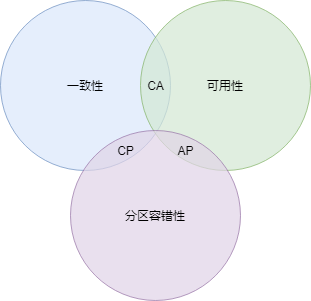

# Kafka 高可用机制
谈到高可用，一定绕不开的一个概念，那就是CAP原则。它指的是在一个分布式系统中， Consistency（一致性）、 Availability（可用性）、Partition tolerance（分区容错性），三者不可得兼。

对于分布式系统的设计要求，我们的初衷是保证单个节点或几个节点失败的情况下，不影响系统整体提供服务，也就是要保证分区容错性。当出现这种情况时，我们通常有两种做法，不断重试直到恢复或者依赖存活的节点继续提供服务。

如果选择依赖存活节点提供服务，就是选择了AP，能保证可用性，但不能保证数据在各个节点的统一。反之选择的就是CP，重试直到恢复，保证所有节点数据相同。

