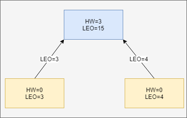
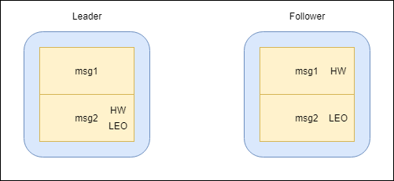
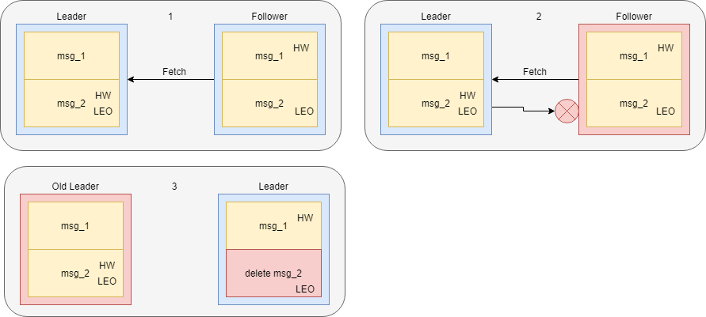
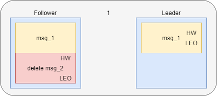
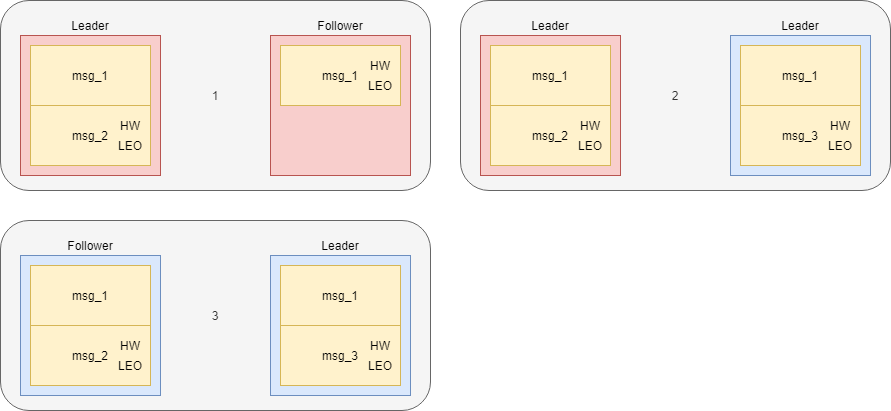

# Kafka高可用机制（下）
上一篇文章中讲解了消息写入Broker的全流程，当Leader收到消息后，它会先更新自己记录的对应Follower的LEO，再将数据返回给Follower。本文将讲述在异常情况下Kafka如何实现高可用，以及Kafka在更新迭代中的优化。

Kafka使用HW+ISR机制保证Consumer能看到的消息，一定是写入成功的消息，从而保证了Broker到Consumer的数据一致性。以HW为切入点，我们看两个异常情况。

## 异常：消息丢失

假设某一时间。Broker运行到了如前文图3的位置。

此时Leader已经写入了HW=3，但Follower需要等待来自Leader的返回值才能将自己的HW也更新为3（为简化描述，从此处开始只有一个Leader和一个Follower）。假如此时Follower宕机，没有收到来自Leader的返回值。

**然后Follower恢复，此时Leader又宕机，那么Follower就不会收到它宕机之前的HW消息。并且因为此时这个Follower会做日志截断，HW之后的消息会被删除（delete msg_2）**。此时Producer 认为已经发送成功，但因为Leader的转换，其实没有真实接收到。

下面用更详细的图例说明

当旧Leader恢复之后，会作为Follower存在，**又因为F的HW不能比L更领先，所以也会截断日志，此时msg_2就会彻底丢失**。

不难看出，上面出现消息丢失的关键步骤就是日志截断。不妨考虑一下MySQL的InnoDB引擎，当它宕机后会根据redo log 文件做日志截断，截断未完成的事务。综合来讲，Kafka作为一个消息中间件，消息的一致性（或者说顺序性）远比是否丢失消息更重要。如果不做日志截断，则有可能出现数据不一致的情况。

## 异常：消息不一致

假设某一时刻，Leader种有两条消息msg1和msg2，且LEO和HW均为msg2；Follower中有一条消息msg1，且LEO和HW均为msg1。

此时两者同时宕机，然后Follower先恢复称为新Leader，并写入了消息msg3。

当旧Leader恢复时，会成为Follower，发现HW同时都为offset=2，所以继续正常运行接收消息。至此，Leader和Follower出现消息不一致的情况。

## 解决：Leader Epoch

看得出无法单纯通过HW来解决宕机后的数据问题，所以Kafka在0.11.0.0之后引入了Leader Epoch机制，在需要做日志截断时，以Leader Epoch作为依据而不再是HW。

