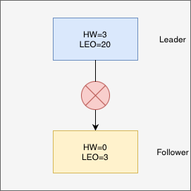

# Kafka高可用机制（下）
上一篇文章中讲解了消息写入Broker的全流程，当Leader收到消息后，它会先更新自己记录的对应Follower的LEO，再将数据返回给Follower。本文将讲述在异常情况下Kafka如何实现高可用，以及Kafka在更新迭代中的优化。

Kafka使用HW+ISR机制保证Consumer能看到的消息，一定是写入成功的消息，从而保证了Broker到Consumer的数据一致性。以HW为切入点，我们看一个异常情况。

假设某一时间。Broker运行到了如前文图3的位置。

此时Leader已经写入了HW=3，但Follower需要等待来自Leader的返回值才能将自己的HW也更新为3（为简化描述，从此处开始只有一个Leader和一个Follower）。假如此时Follower宕机，没有收到来自Leader的返回值。

然后Follower恢复，此时Leader又宕机，那么Follower就不会收到它宕机之前的HW消息，如果Follower宕机前的HW=2，那么offset=3这条消息就相当于丢失了。因为 Producer 认为已经发送成功，但此时因为Leader的转换，其实没有真实接收到。

下面用更详细的图例说明

//图片

