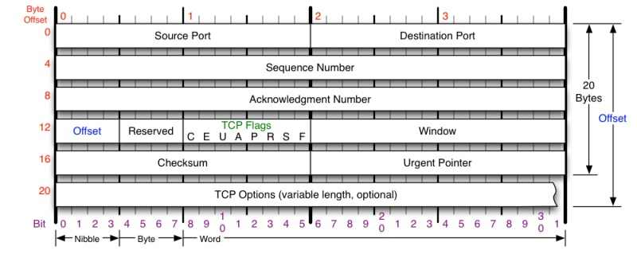
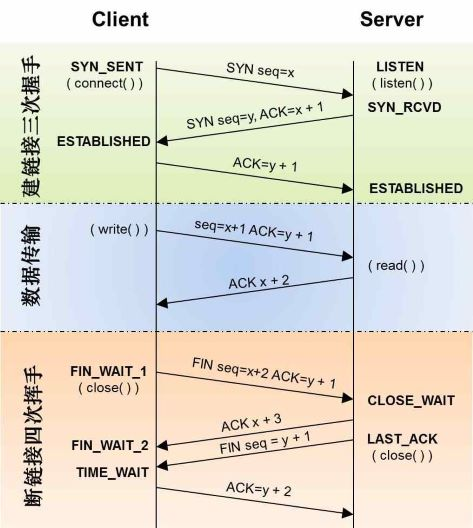
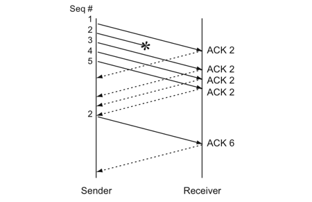
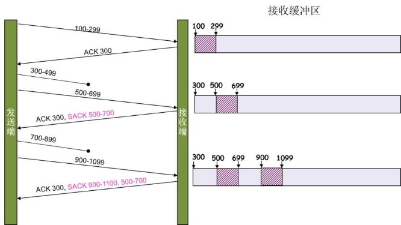

# TCP 概览
## TCP 头格式

上图中有四个非常重要的概念：
1. **Sequence Number** 是包的序号，用来解决网络包乱序问题
2. **Acknowledgment Number** 就是ACK，用于确认收到，用来解决不丢包问题
3. **Window** 又叫 Advertised Window，也就是滑动窗口，用来解决流控问题
4. **TCP Flag** 也就是包类型，主要用于操控TCP状态机

TCP在网络OSI七层模型中的第四层——Transport层，IP在第三层——Network层，ARP在第二层——Data Link层；在第二层上的数据我们叫做Frame，第三层上的数据叫做Packet，第四层上的数据叫做Segment。

## 状态机
其实，网络上的传输是没有连接的，包括TCP也是一样。而TCP所谓的“连接”，只不过是在通讯的双方维护一个“连接状态”，让它看上去好像有连接一样。

### TCP 握手与挥手机制

## 重传机制
SeqNum和Ack是以字节数为单位，所以ack的时候，不能跳着确认，只能确认最大的连续收到的包，不然，发送端就以为之前的都收到了。

假如，发送端发了1,2,3,4,5一共五份数据，接收端收到了1，2，于是回ack 3，然后收到了4（注意此时3没收到），此时的TCP会怎么办？
### 超时重传机制
不回ack，死等3，当发送方发现收不到3的ack超时后，会重传3。一旦接收方收到3后，会ack 回 4——意味着3和4都收到了。

:exclamation: **缺点：**	因为要死等这个3，所以后面的4和5即便收到了，而发送方也完全不知道发生了什么，因为没有收到 ack，所以有可能也会重传4和5。

对此有两种选择：
- 仅重传timeout的包，也就是第3份数据。（这种方式节省带宽，但是慢）
- 重传timeout后的所有数据，也就是第3、4、5三份数据。（这种方式快一点，但会浪费带宽）

这两种方式不难看出，都是在等timeout，而timeout的时间可能会很长。

### 快速重传机制
**不以时间驱动，而已数据驱动重传。** 如果包没有到达，就ack最后那个丢了的包，如果发送方接收到3次相同的ack，就重传。

如果发送方发出了1，2，3，4，5份数据，第一份先到送了，于是就ack回2，结果2因为某些原因没收到，3到达了，于是还是ack回2，后面的4和5都到了，但是还是ack回2，因为2还是没有收到，于是发送端收到了三个ack=2的确认，知道了2还没有到，于是就马上重转2。然后，接收端收到了2，此时因为3，4，5都收到了，于是ack回6。

:exclamation: **缺点：** 快速重传机制只解决了timeout的问题，它依然面临着一个艰难的选择，是重传之前的一个还是重传所有的包。

### SACK
这种方式需要在TCP头里加一个SACK的东西，ACK还是Fast Retransmit的ACK，SACK则是汇报收到的数据碎版。参看下图：

在发送端就可以根据回传的SACK来知道哪些数据到了，哪些没有到。于是就优化了Fast Retransmit的算法。当然，这个协议需要两边都支持。

## 滑动窗口
TCP解决了两个非常重要的问题**可靠传输**和**包乱序**。在解决这两个问题的过程中，TCP 必须知道网络实际的数据处理带宽或是数据处理速度，这样才不会引起网络阻塞，导致丢包。

滑动窗口（Sliding Window）就是TCP用来解决网络流控的技术之一。上面有说到TCP头中有个字段叫作window，又叫Advertised-Window，**这个字段是接收端告诉发送端自己还有多少缓冲区可以接收数据。于是发送端就可以根据这个接收端的处理能力来发送数据，而不会导致接收端处理不过来。**

滑动窗口示意图：

- #1 已收到ack确认的数据
- #2 已发送，还未收到ack的
- #3 在窗口中还没有发出去的（接收方还有空间）
- #4 窗口意外的数据（接收方没有空间了）

滑动后的示意图：

依照这个流程，如果接收端的处理速度远小于发送端，那么很快发送端的窗口就会变成0。为了解决这个问题TCP引入了Zero Window Probe技术，缩写ZWP。当发送端窗口变成0后，会发送一个ZWP包给接收方，让接收方来ack他的window尺寸，一般这个值会设置成3此，间隔大约30-60秒。如果3此之后还是0的话，有的TCP实现就会把链接断开了。

#### 参考资料
*https://coolshell.cn/articles/11564.html*

*https://coolshell.cn/articles/11609.html*