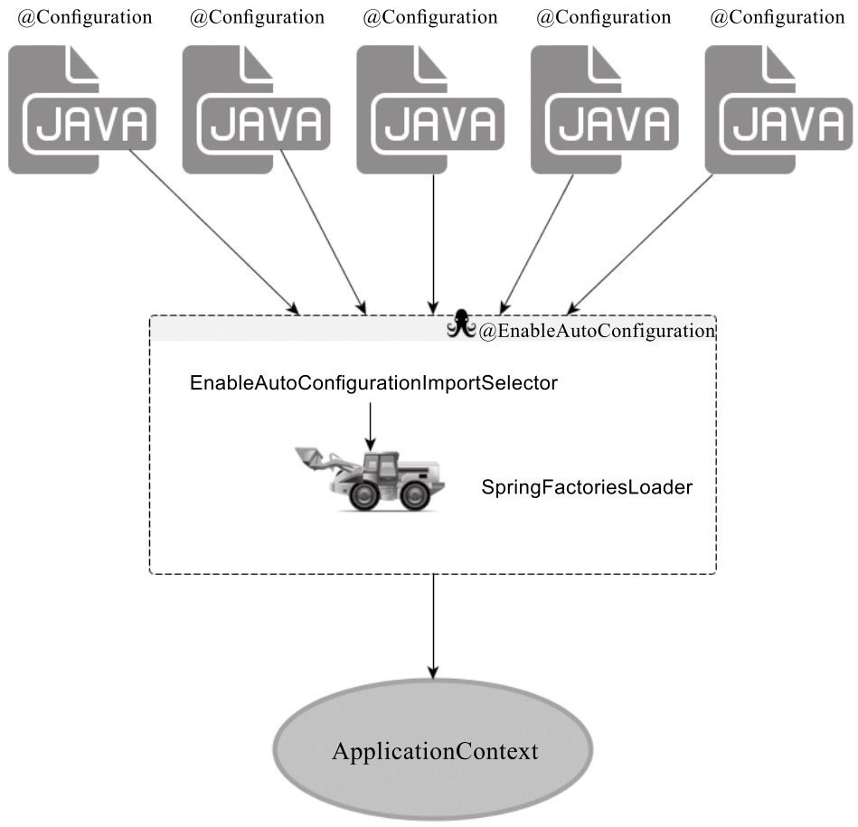

# Spring Boot 工作机制
不妨先看一下典型的SpringBoot 应用长什么样子。
```java
import org.springframework.boot.SpringApplication;
import org.springframework.boot.autoconfigure.SpringBootApplication;

@SpringBootApplication
public class DemoApplication {
    public static void main(String[] args) {
        SpringApplication.run(DemoApplication.class,args);
    }
}
```
不难看出和之前用Spring 搭建环境最不同的便是 @SpringBootApplication 和 SpringApplication.run 这两处。那我们就从这里开始揭开 Spring Boot 的工作机制。

## @SpringBootApplication
@SpringBootApplication 其实是一个复合注解。
```java
@Target(ElementType.Type)
@Retention(RetentionPolicy.RUNTIME)
@Document
@Inherited
@Configuration
@EnableAutoConfiguration
@ComponentScan
public @interface SpringBootApplication{
    //...
}
```
虽然其中使用了很多注解，但实际上对于SpringBoot应用来说，重要的只有三个注解：
1. @Configuration
2. @EnableAutoConfiguration
3. @ComponentScan

所以，如果我们使用如下启动类，整个SpringBoot 引用依然可以与之前启动类功能对等：
```java
@Configuration
@EnableAutoConfiguration
@ComponentScan
public class DemoApplication {
    public static void main(String[] args) {
        SpringApplication.run(DemoApplication.class,args);
    }
}
```
### @Configuration
其实这里的 @Configuration 就是 JavaConfig 形式的 Spring IoC 容器配置类使用的那个 @Configuration，既然 SpringBoot 应用骨子里就是一个 Spring 应用，那么自然也需要加载某个IoC 容器的配置。而SpringBoot 社区推荐使用基于 JavaConfig 的配置形式，所以很明显这里的启动类标注了@Configuration 之后，本身其实也是一个IoC 容器的配置类。

所以上文中说到的启动类 DemoApplication 其实就是一个标准的 Standalone 类型 Java 程序的 main 函数启动类，没什么特别的。

### @EnableAutoConfiguration
这个注解的功能主要就是借助 @Import 的支持，收集和注册特定场景相关的 bean 定义。将所有符合自动配置条件的 bean 定义加载到 IoC 容器，仅此而已。

@EnableAutoConfiguration 本身也是一个复合注解：
```java
@Target(ElementType.Type)
@Retention(RetentionPolicy.RUNTIME)
@Document
@Inherited
@AutoConfigurationPackage
@Import(EnableAutoConfigurationImportSelector.class)
public @interface EnableAutoConfiguration {
    //...
}
```
借助 EnableAutoConfigurationImportSelector 将所有符合条件的 @Configuration 配置都加载到当前 SpringBoot 创建并使用的 IoC 容器。再借助 SpringFactoriesLoader 的支持，@EnableAutoConfiguration 可以“智能”的自动配置便呈现出来了。


### 幕后英雄——SpringFactoriesLoader
SpringFactoriesLoader 属于Spring 框架私有的一种扩展方案（类似于SPI机制），**其主要功能就是从指定的配置文件 META-INF/spring.factories 加载配置**，spring.factories 是一个典型的 java properties 文件，配置格式 KEY -VALUE，其KEY和VALUE都是Java类型的完整类名。
```
com.example.MyService = com.example.MyServiceImpl01, com.example.MyServiceImpl02
```
虽然其本意是提供一种类似SPI机制的解决方案，但在 @EnableAutoConfiguration 中它更多的是提供了易总配置查找的功能支持。这样就不难理解，@EnableAutoConfiguration 的魔法其实就是：
1. 从 classpath 中搜寻所有的 META-INF/spring.factories 配置文件
2. 将配置文件中 org.springframework.boot.autoconfigure.EnableAutoConfiguration 对应的配置项通过反射实例化为对应的标注了 @Configuration 的JavaConfig 形式的IoC 容器配置类

### @ComponentScan
@ComponentScan 其实就是自动扫描并加载符合条件的组件或 bean 定义，最终将这些 bean 定义加载到容器中。

但是加载 bean 定义可以手工单个注册，又或者当前应用没有任何 bean 定义需要通过 @ComponentScan 加载到当前 IoC 容器，那么@ComponentScan 这个注解就不需要了。

##  SpringApplication
本文截止到这里，上面谈到的东西其实都是 Spring 时代的东西，没有新的事物。接下来要说的才是 SpringBoot 应用自己特有的东西。

SpringApplication 将一个典型的 Spring 应用启动的流程“模板化”，在没有特殊需求的情况下，默认的模板化流程即可满足需求。
```java
SpringApplication.run(DemoApplication.class,args);
```
针对于特殊需求，SpringApplication 在合适的流程节点开放了一系列不同类型的扩展点，我们可以通过这些扩展点对程序的启动和关闭过程进行扩展。

### 参考资料
- 《Spring Boot 揭秘》作者：王福强