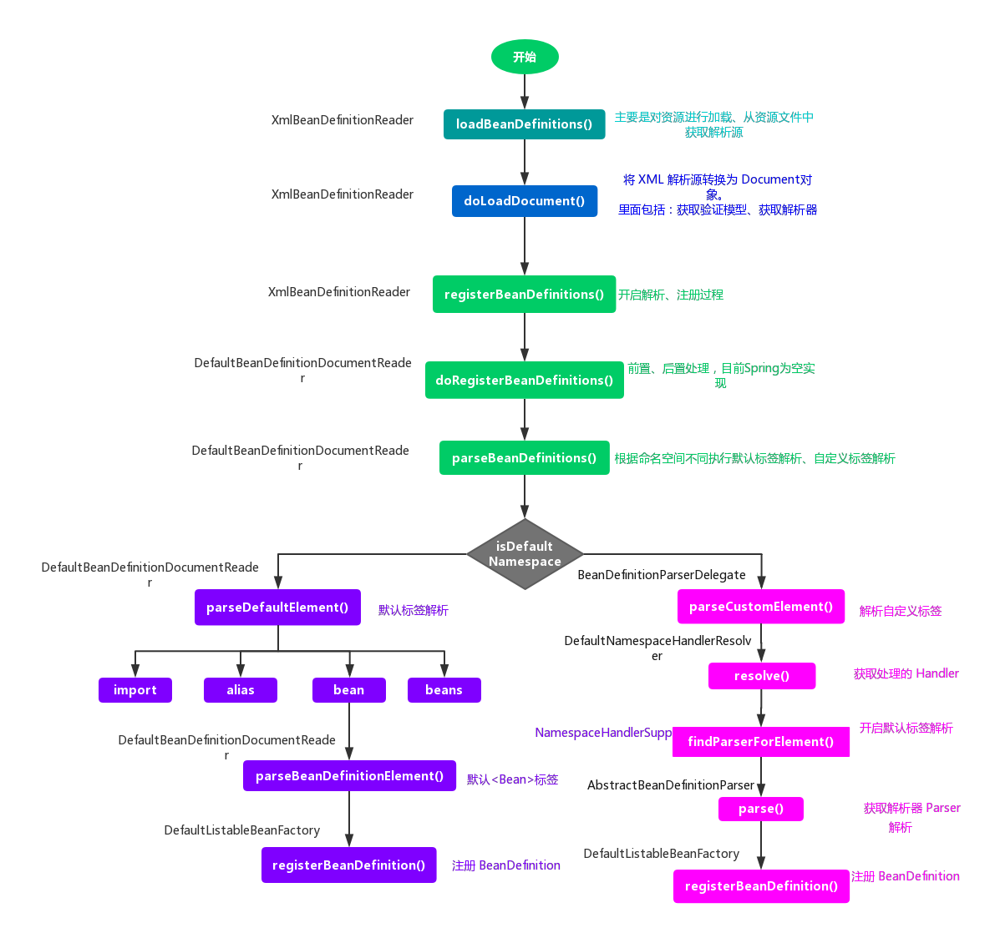

# Spring IOC 容器初始化
## 概述
IOC 容器的初始化过程分为三步骤：Resource 定位、BeanDefinition 的载入和解析，BeanDefinition 注册。


1. Resource 定位。我们一般用外部资源来描述 Bean 对象，所以在初始化 IOC 容器的第一步就是需要定位这个外部资源。
2. BeanDefinition 的载入和解析。装载就是 BeanDefinition 的载入。BeanDefinitionReader 读取、解析 Resource 资源，也就是将用户定义的 Bean 表示成 IOC 容器的内部数据结构：BeanDefinition。在 IOC 容器内部维护着一个 BeanDefinition Map 的数据结构，在配置文件中每一个都对应着一个BeanDefinition对象。
3. BeanDefinition 注册。向IOC容器注册在第二步解析好的 BeanDefinition，这个过程是通过 BeanDefinitionRegistery 接口来实现的。**在 IOC 容器内部其实是将第二个过程解析得到的 BeanDefinition 注入到一个 HashMap 容器中**，IOC 容器就是通过这个 HashMap 来维护这些 BeanDefinition 的。**在这里需要注意的一点是这个过程并没有完成依赖注入，依赖注册是发生在应用第一次调用 getBean() 向容器索要 Bean 时。** 当然我们可以通过设置预处理，即对某个 Bean 设置 lazyinit 属性，那么这个 Bean 的依赖注入就会在容器初始化的时候完成。

这段代码是 Spring 中编程式使用 IOC 容器，通过这四段简单的代码，我们可以初步判断 IOC 容器的使用过程。
```Java
// 根据 Xml 配置文件创建 Resource 资源对象。ClassPathResource 是 Resource 接口的子类，bean.xml 文件中的内容是我们定义的 Bean 信息。
ClassPathResource resource = new ClassPathResource("bean.xml");
// 创建一个 BeanFactory。DefaultListableBeanFactory 是 BeanFactory 的一个子类，BeanFactory 作为一个接口，其实它本身是不具有独立使用的功能的，而 DefaultListableBeanFactory 则是真正可以独立使用的 IOC 容器，它是整个 Spring IOC 的始祖。
DefaultListableBeanFactory factory = new DefaultListableBeanFactory();
// 创建 XmlBeanDefinitionReader 读取器，用于载入 BeanDefinition 。
XmlBeanDefinitionReader reader = new XmlBeanDefinitionReader(factory);
// 开启 Bean 的载入和注册进程，完成后的 Bean 放置在 IOC 容器中。
reader.loadBeanDefinitions(resource);
```
## 流程概览
